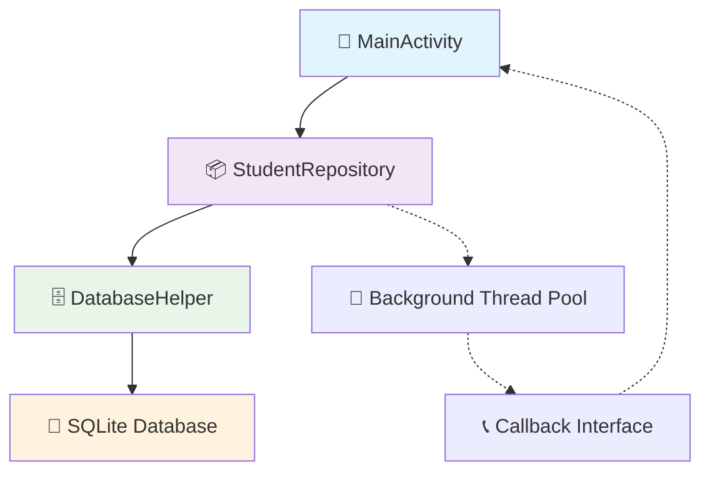
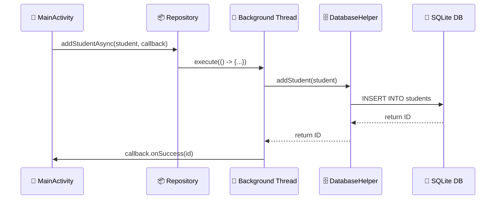

# 🚀 Improved SQLite Database Implementation for Android

This project demonstrates a modern, efficient SQLite database implementation for Android applications with significant improvements over traditional approaches.

## ✨ Key Improvements

### 1. 🐛 **Fixed Critical Bugs**
- Corrected constructor mismatch in `getStudent()` method
- Proper cursor resource management with null checks
- Fixed column index access using `getColumnIndexOrThrow()`

### 2. 🔒 **Singleton Pattern**
- Prevents multiple database instances
- Reduces memory overhead
- Thread-safe implementation

### 3. 🏗️ **Repository Pattern**
- Separates data access logic from UI
- Provides clean API for database operations
- Enables easy testing and mocking

### 4. ⚡ **Asynchronous Operations**
- All database operations run on background threads
- Prevents ANR (Application Not Responding) errors
- Callback-based error handling

### 5. 🛡️ **Resource Management**
- Proper cursor and database closing
- Memory leak prevention
- Executor service management

## 🏛️ Architecture



## 💡 Usage Example

```java
package com.example.sqliteproject;

StudentRepository repository = new StudentRepository(context);

// Add student asynchronously
repository.addStudentAsync(new Student("John"), new DatabaseCallback<Long>() {
    @Override
    public void onSuccess(Long id) {
        Log.d(TAG, "Student added with ID: " + id);
    }
    
    @Override
    public void onError(Exception error) {
        Log.e(TAG, "Error adding student", error);
    }
});
```

## 🔄 Database Operations Flow



## ✅ Best Practices Implemented

- 🔒 Singleton pattern for database access
- 🧵 Background thread operations
- 🛡️ Proper resource management
- ⚠️ Error handling with callbacks
- 🏗️ Clean separation of concerns
- 🔐 Thread-safe operations
- 🚫 Memory leak prevention

## 🚀 Deployment

The project includes automated deployment testing:

```bash
# Local deployment check
./deploy-check.sh

# GitHub Actions workflow
# Automatically runs on push/PR to main branch
```

### 📋 Deployment Checklist
- ✅ Code quality validation
- ✅ Build process simulation  
- ✅ Test execution verification
- ✅ Security and best practices check

## 📁 Project Structure

```
sqlite-db-project/
├── settings.gradle
├── gradle.properties
├── deploy-check.sh
├── .github/workflows/deploy-dry-run.yml
└── app/
    ├── build.gradle
    └── src/main/
        ├── AndroidManifest.xml
        ├── java/com/example/sqliteproject/
        │   ├── MainActivity.java
        │   ├── DatabaseHelper.java
        │   ├── StudentRepository.java
        │   └── Student.java
        └── res/layout/
            └── activity_main.xml
```

### 📄 Key Files
- 📱 `MainActivity.java` - Usage demonstration
- 🗄️ `DatabaseHelper.java` - SQLite database management
- 📦 `StudentRepository.java` - Repository pattern implementation
- 📄 `Student.java` - Data model class
- 🚀 `.github/workflows/deploy-dry-run.yml` - CI/CD pipeline
- 🛠️ `deploy-check.sh` - Local deployment validation