# 🚀 Improved SQLite Database Implementation for Android

This project demonstrates a modern, efficient SQLite database implementation for Android applications with significant improvements over traditional approaches.

## 🚀 Features

### � **Complete CRUD Operations**
- ➕ **Create**: Add new students with async operations
- 📖 **Read**: Retrieve single student by ID or all students
- ✏️ **Update**: Modify existing student information
- 🗑️ **Delete**: Remove students from database
- 📈 **Count**: Get total number of students

### 🏛️ **Architecture Patterns**
- 🔒 **Singleton Pattern**: Thread-safe database instance management
- 📦 **Repository Pattern**: Clean separation of data access logic
- 🧵 **Async Operations**: All database operations on background threads
- 📞 **Callback Interface**: Consistent error handling and result delivery

### 🛡️ **Robust Error Handling**
- ✅ Proper cursor resource management with null checks
- 🔍 Safe column access using `getColumnIndexOrThrow()`
- 🧹 Automatic cleanup to prevent memory leaks
- ⚠️ Exception handling with detailed error callbacks

## 🏛️ Architecture

```mermaid
graph TD
    A[📱 MainActivity] --> B[📦 StudentRepository]
    B --> C[🗄️ DatabaseHelper]
    C --> D[💾 SQLite Database]
    
    B -.-> E[🧵 Background Thread Pool]
    E -.-> F[📞 Callback Interface]
    F -.-> A
    
    style A fill:#e1f5fe
    style B fill:#f3e5f5
    style C fill:#e8f5e8
    style D fill:#fff3e0
```



## 💡 Usage Examples

### 📝 Adding Students
```java
StudentRepository repository = new StudentRepository(context);

// Add student asynchronously
repository.addStudentAsync(new Student("John"), new StudentRepository.DatabaseCallback<Long>() {
    @Override
    public void onSuccess(Long id) {
        Log.d(TAG, "Student added with ID: " + id);
    }
    
    @Override
    public void onError(Exception error) {
        Log.e(TAG, "Error adding student", error);
    }
});
```

### 📖 Retrieving Students
```java
// Get all students
repository.getAllStudentsAsync(new StudentRepository.DatabaseCallback<List<Student>>() {
    @Override
    public void onSuccess(List<Student> students) {
        Log.d(TAG, "Retrieved " + students.size() + " students");
        for (Student student : students) {
            Log.d(TAG, student.toString());
        }
    }
    
    @Override
    public void onError(Exception error) {
        Log.e(TAG, "Error loading students", error);
    }
});

// Get student by ID
repository.getStudentAsync(1, new StudentRepository.DatabaseCallback<Student>() {
    @Override
    public void onSuccess(Student student) {
        if (student != null) {
            Log.d(TAG, "Found: " + student.toString());
        } else {
            Log.d(TAG, "Student not found");
        }
    }
    
    @Override
    public void onError(Exception error) {
        Log.e(TAG, "Error getting student", error);
    }
});
```

### ✏️ Updating Students
```java
Student updatedStudent = new Student(1, "John Updated");
repository.updateStudentAsync(updatedStudent, new StudentRepository.DatabaseCallback<Integer>() {
    @Override
    public void onSuccess(Integer rowsAffected) {
        Log.d(TAG, "Updated " + rowsAffected + " rows");
    }
    
    @Override
    public void onError(Exception error) {
        Log.e(TAG, "Error updating student", error);
    }
});
```

### 🗑️ Deleting Students
```java
repository.deleteStudentAsync(1, new StudentRepository.DatabaseCallback<Boolean>() {
    @Override
    public void onSuccess(Boolean deleted) {
        Log.d(TAG, deleted ? "Student deleted successfully" : "Student not found");
    }
    
    @Override
    public void onError(Exception error) {
        Log.e(TAG, "Error deleting student", error);
    }
});
```

### 🧹 Resource Cleanup
```java
@Override
protected void onDestroy() {
    super.onDestroy();
    // Important: Clean up resources to prevent memory leaks
    if (repository != null) {
        repository.shutdown();
    }
}
```

## 🔄 Database Operations Flow

```mermaid
sequenceDiagram
    participant UI as 📱 MainActivity
    participant Repo as 📦 Repository
    participant Thread as 🧵 Background Thread
    participant DB as 🗄️ DatabaseHelper
    participant SQLite as 💾 SQLite DB
    
    UI->>Repo: addStudentAsync(student, callback)
    Repo->>Thread: execute(() -> {...})
    Thread->>DB: addStudent(student)
    DB->>SQLite: INSERT INTO students
    SQLite-->>DB: return ID
    DB-->>Thread: return ID
    Thread->>UI: callback.onSuccess(id)
```



## ⚙️ Technical Specifications

### 📋 **Requirements**
- **Minimum SDK**: Android API 21 (Android 5.0)
- **Target SDK**: Android API 34 (Android 14)
- **Java Version**: JDK 17
- **Build Tool**: Gradle with Android Plugin

### 🏗️ **Database Schema**
```sql
CREATE TABLE students (
    id INTEGER PRIMARY KEY AUTOINCREMENT,
    name TEXT NOT NULL
);
```

### 📊 **Performance Optimizations**
- **Thread Pool**: Fixed pool of 2 background threads for optimal mobile performance
- **Connection Management**: Singleton pattern reduces database connection overhead
- **Query Optimization**: Efficient SQL queries with proper indexing on primary key
- **Memory Management**: Proper cursor and resource cleanup prevents memory leaks

### 🔧 **Configuration**
- **Database Name**: `student_db`
- **Database Version**: 1
- **Thread Pool Size**: 2 (optimized for mobile devices)
- **Executor Service**: `Executors.newFixedThreadPool(2)`

## ✅ Best Practices Implemented

- 🔒 **Singleton Pattern**: Thread-safe database access with single instance
- 🧵 **Background Operations**: All database operations on background threads
- 🛡️ **Resource Management**: Proper cursor closing and memory leak prevention
- ⚠️ **Error Handling**: Comprehensive exception handling with callbacks
- 🏗️ **Separation of Concerns**: Clean architecture with repository pattern
- 🔐 **Thread Safety**: Synchronized database instance creation
- 🚫 **ANR Prevention**: Async operations prevent UI blocking
- 📊 **Performance**: Optimized thread pool and connection management

## 🚀 Getting Started

### 📋 **Prerequisites**
- **Android Studio**: Arctic Fox (2020.3.1) or later
- **JDK**: Version 17 or higher
- **Android SDK**: API levels 21-34 installed
- **Git**: For version control and cloning
- **Device/Emulator**: Android 5.0 (API 21) or higher

### ⚡ **Quick Setup**
1. **Clone the repository**:
   ```bash
   git clone https://github.com/bshongwe/sqlite-db-project.git
   cd sqlite-db-project
   ```

2. **Open in Android Studio**:
   - Launch Android Studio
   - Select "Open an existing project"
   - Navigate to the cloned directory
   - Wait for Gradle sync to complete

3. **Build and Run**:
   - Let Android Studio sync the project (this may take a few minutes on first run)
   - Connect an Android device (enable USB debugging) or start an emulator
   - Click "Run" (▶️) or use `Ctrl+R` (Windows/Linux) / `Cmd+R` (Mac)
   - Select your target device/emulator

4. **Verify Installation**:
   ```bash
   # Run local deployment check (requires bash/Git Bash on Windows)
   ./deploy-check.sh
   ```

### 🧪 **Testing the Application**

#### 📱 **Running the App**
The app will automatically:
- Initialize the SQLite database (`student_db`)
- Create the students table with proper schema
- Add sample students ("Alice" and "Bob") asynchronously
- Display all database operation results in Android logcat
- Demonstrate complete CRUD operations

#### 📊 **Viewing Results**
1. **Android Studio Logcat**:
   - Open View → Tool Windows → Logcat
   - Filter by tag "MainActivity" to see database operations
   - Look for success/error messages from all CRUD operations

2. **Expected Output**:
   ```
   D/MainActivity: Student added with ID: 1
   D/MainActivity: Student added with ID: 2
   D/MainActivity: Retrieved 2 students:
   D/MainActivity: Student{id=1, name='Alice'}
   D/MainActivity: Student{id=2, name='Bob'}
   ```

#### 🔍 **Manual Testing**
You can modify `MainActivity.java` to test additional scenarios:
- Add more students with different names
- Update existing student records
- Delete students and verify removal
- Test error handling with invalid operations

### 🛠️ **Development Setup**

#### 📁 **Project Structure Verification**
After cloning, ensure these key files exist:
```
sqlite-db-project/
├── ✅ app/src/main/java/com/example/sqliteproject/
│   ├── ✅ MainActivity.java
│   ├── ✅ DatabaseHelper.java
│   ├── ✅ StudentRepository.java
│   └── ✅ Student.java
├── ✅ app/build.gradle
├── ✅ settings.gradle
└── ✅ deploy-check.sh
```

#### 🔧 **Gradle Configuration**
The project uses:
- Gradle 8.0+
- Android Gradle Plugin 8.0+
- Compile SDK 34
- Min SDK 21, Target SDK 34

#### 🐛 **Troubleshooting**
| Issue | Solution |
|-------|----------|
| Gradle sync fails | Ensure JDK 17 is installed and configured in Android Studio |
| App crashes on launch | Check device/emulator API level (must be 21+) |
| Database operations fail | Verify logcat for SQLException details |
| Deploy script fails | Ensure bash is available (use Git Bash on Windows) |

### 🤝 **For Contributors**

#### 🔍 **Code Quality Checks**
Before submitting PRs, run:
```bash
# Local validation
./deploy-check.sh

# Manual verification
grep -r "TODO\|FIXME" app/src/main/java/ || echo "No TODOs found"
```

#### 📝 **Making Changes**
1. Fork the repository
2. Create a feature branch: `git checkout -b feature/your-feature-name`
3. Make your changes following the existing patterns
4. Test thoroughly with different scenarios
5. Run deployment checks
6. Submit a pull request with detailed description

#### 🧪 **Testing Guidelines**
- Test all CRUD operations
- Verify async behavior doesn't block UI
- Check proper resource cleanup
- Validate error handling scenarios
- Test on different Android versions (API 21-34)

## 🧪 Testing & Quality Assurance

### 🚀 **Automated Deployment Pipeline**
The project includes comprehensive CI/CD automation:

```bash
# Local deployment check
./deploy-check.sh

# GitHub Actions workflow
# Automatically runs on push/PR to main branch
```

### 📋 **Quality Checks**
- ✅ **Project Structure Validation**: Ensures all required files are present
- ✅ **Package Declaration Verification**: Validates correct package structure
- ✅ **Best Practices Detection**: Confirms singleton, async, and safe column access patterns
- ✅ **Syntax Validation**: Basic Java syntax and structure verification
- ✅ **Code Quality Analysis**: Line count analysis and TODO/FIXME detection
- ✅ **Build Simulation**: Complete Android build process validation
- ✅ **Test Coverage**: Simulated unit and integration test execution

### 🔍 **Deployment Readiness Checklist**
- ✅ Code quality validation
- ✅ Build process simulation  
- ✅ Test execution verification
- ✅ Security and best practices check
- ✅ Resource management validation
- ✅ Thread safety verification

## 📁 Project Structure

```
sqlite-db-project/
├── settings.gradle
├── gradle.properties
├── deploy-check.sh
├── .github/workflows/deploy-dry-run.yml
└── app/
    ├── build.gradle
    └── src/main/
        ├── AndroidManifest.xml
        ├── java/com/example/sqliteproject/
        │   ├── MainActivity.java
        │   ├── DatabaseHelper.java
        │   ├── StudentRepository.java
        │   └── Student.java
        └── res/layout/
            └── activity_main.xml
```

### 📄 Key Files
- 📱 `MainActivity.java` - Demonstrates all database operations with proper async handling
- 🗄️ `DatabaseHelper.java` - Singleton-based SQLite database management with CRUD operations
- 📦 `StudentRepository.java` - Repository pattern implementation with async callbacks
- � `Student.java` - Simple data model class with multiple constructors
- 🚀 `.github/workflows/deploy-dry-run.yml` - Comprehensive CI/CD pipeline
- 🛠️ `deploy-check.sh` - Local deployment validation script
- 🔧 `app/build.gradle` - Android project configuration with JDK 17 support